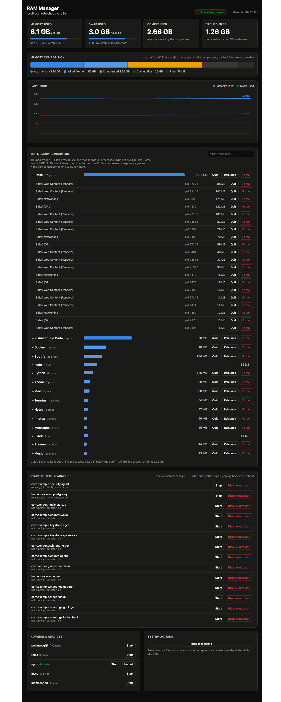
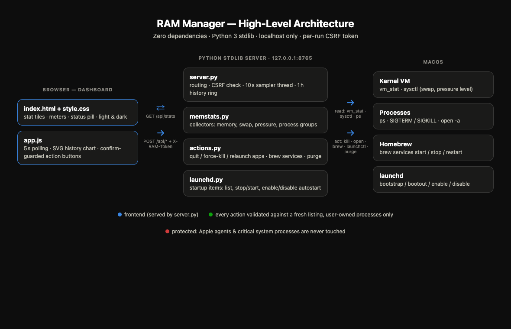

# 🧠 RAM Manager

**A zero-dependency, actionable memory dashboard for macOS.** See what is eating
your RAM, then fix it from the same page — quit apps, restart services, and stop
background items from autostarting at login.


<p align="center">
  
</p>

## ✨ Features

- **Live overview** — memory and swap meters (red when hot), compression savings,
  reclaimable cache, and a pressure pill fed by the kernel's own
  `memorystatus_vm_pressure_level`. Refreshes every 5 seconds; light & dark mode.
- **One-hour history** — memory and swap as a two-series chart with hover crosshair.
- **Memory composition bar** — how "used" actually adds up (app + wired +
  compressed + cached + free), so the numbers are explainable at a glance.
- **Top memory consumers** — processes grouped per app (a browser's 20 helper
  processes fold into one row), with **Quit** (SIGTERM), **Relaunch**
  (quit + reopen), and **Force** (SIGKILL) buttons. Click a group to expand
  every individual process with its own RAM figure and per-PID Quit/Force
  controls; a filter box narrows the list, and a tail line reports what falls
  below the top-15 cutoff.
- **Startup items** — every launchd agent with its live state; *Disable autostart*
  keeps it from ever launching at login again.
- **Homebrew services** — stop, start, or restart them in one click.
- **Nothing runs silently with elevated rights** — actions that would need `sudo`
  (like purging the disk cache) are never executed behind your back; the
  dashboard hands you the exact shell command to run yourself.

## 🚀 Quick start

```bash
git clone https://github.com/kaiser-data/mac-ram-manager.git
cd mac-ram-manager
python3 server.py
# → open http://127.0.0.1:8765
```

No pip install, no npm, no config — Python 3.9+ standard library only.

Prefer it always available? Register it as a login agent:

```bash
./install.sh            # dashboard runs at every login
./install.sh uninstall  # remove again
```

## 🏛️ Architecture

<p align="center">
  
</p>

Interactive, theme-aware version: open
[`docs/architecture.html`](docs/architecture.html) in a browser.

A single threaded stdlib HTTP server binds to `127.0.0.1` only. A background
thread samples `vm_stat` + `sysctl` every 10 s into a one-hour ring buffer. The
dashboard polls `/api/stats`, which merges live memory figures, per-app process
groups (from `ps`), Homebrew services, and launchd startup items. Action
endpoints are POST-only and guarded by a per-run CSRF token injected into the
page at load.

## 🔒 Safety model

- Binds to **localhost only**; nothing is reachable from the network.
- Mutating endpoints require the **per-run CSRF token** (constant-time compared).
- Signals only go to **processes you own** — PIDs are re-resolved from a fresh
  `ps` listing at action time, never trusted from the client.
- **Protected server-side**: critical system processes (`WindowServer`,
  `Finder`, `launchd`, …) and all `com.apple.*` agents are refused.
- Destructive buttons confirm first; anything needing `sudo` is shown as a
  command instead of executed.

## 🔌 API

| Endpoint | Method | Body | Does |
|---|---|---|---|
| `/api/stats` | GET | – | full snapshot: memory, swap, pressure, groups, history, services, agents |
| `/api/kill-group` | POST | `{name, force?}` | SIGTERM/SIGKILL all your processes in a group |
| `/api/kill-pid` | POST | `{pid, force?}` | signal one specific process |
| `/api/relaunch-group` | POST | `{name}` | quit an app, then `open -a` it again |
| `/api/service` | POST | `{name, action}` | brew service start/stop/restart |
| `/api/launchd` | POST | `{label, action}` | agent stop/start/enable/disable |
| `/api/purge` | POST | – | purge inactive disk cache |

All responses use the envelope `{"ok": bool, "data": …, "error": …}`.

## 📄 License

MIT — see [LICENSE](LICENSE).

---

🤖 Built with [Claude Code](https://claude.com/claude-code)
